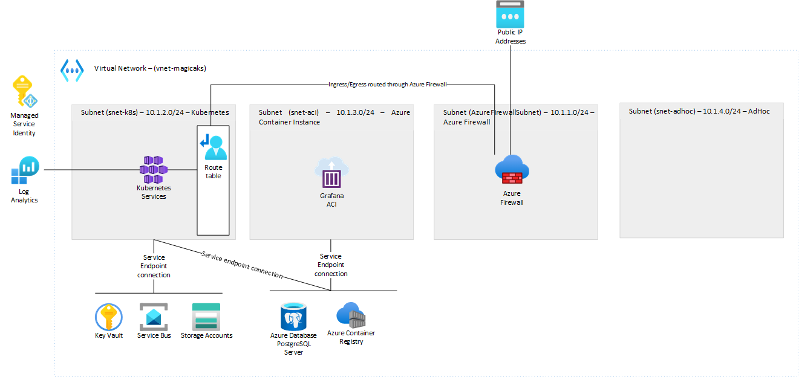

# MagicAKS - Opinionated cluster config for microservices on Azure

## Introduction

Azure Kubernetes service makes it easy to spin up a functional cluster, but there is more to running Kubernetes than the nodes. Making a cluster workable requires good amount of grunt work.

This is an attempt to make it easier to adopt AKS for modern microservice based cloud native applications.

Microservice apps need supporting components to do their job. Selecting what components to use can be daunting. In this repo we have selected components based on experience from projects we have worked on, that we have found most suitable and that make full use of Azure as a cloud computing platform.

The driving force behind this repository is to help you use Azure to its fullest and to let you focus less on configuration and component choices, and more on writing business logic.

## Inspiration and history

This project derives the concept for functional AKS cluster from [Project Bedrock](https://github.com/microsoft/bedrock). Bedrock provides patterns, implementation, and automation for operating production Kubernetes clusters based on a GitOps workflow, building on the best practices discovered while working with operationalizing Kubernetes clusters.

MagicAKS extends the concepts in Bedrock to initialize a cluster with opinionated choice of technologies that work well together. This level on integration provides for a smoother development experience with tooling, monitoring and other infrastructure services. While Bedrock provides guidance for Azure DevOps based release workflows, MagicAKS focuses on Github repositories and actions. Both projects use [Fabrikate](https://github.com/microsoft/fabrikate) for specifying cluster software configs but Fabrikate is a replaceable component and one can use for example [Kustomize](https://kustomize.io/) or any other manifest generation technology.

Bedrock is designed to be general and has some concepts like rings are not reflected in this project at all. MagicAKS focuses specifically on making microservices based development on Azure easy.

## Architecture and components

This repository is by design not general purpose. It simplifies deployment by removing thinking of choices and instead get a working production grade kubernetes cluster so you as a developer can write business logic instead of spending time to figure out infrastructure concerns.

The architecture includes the following components:

* [Azure Service Bus](https://docs.microsoft.com/en-us/azure/service-bus-messaging/service-bus-messaging-overview) as async message bus
* [Azure Container Insights / Azure Monitor](https://docs.microsoft.com/en-us/azure/service-bus-messaging/service-bus-metrics-azure-monitor) for logging and metrics store
* [Azure Active Directory](https://docs.microsoft.com/en-us/azure/active-directory/) for authentication and authorization. Integrated with K8s RBAC
* [Azure Key Vault](https://docs.microsoft.com/en-us/azure/key-vault/general/overview) for secret storage
* [Azure Policy](https://docs.microsoft.com/en-us/azure/governance/policy/overview) for policy enforcement, compliance and governance (Done)

This high-level network architecture diagram shows how components are placed inside of the VNET Subnets. The firewall provides ingress and egress control, with few pre-set FQDNs, that can be adjusted in [networking.tf](./1-pre-provision/networking/networking.tf)

Planned components

* [Azure SQL](https://docs.microsoft.com/en-us/azure/azure-sql/azure-sql-iaas-vs-paas-what-is-overview) as database provider.
* [Azure Application Gateway](https://docs.microsoft.com/en-us/azure/application-gateway/features) as ingress controller.

When needed, the solution uses open source tooling like [kured](https://github.com/weaveworks/kured) to keep cluster nodes up to date.

## Stages

This solution consists of 3 stages.

1. [Pre-provision](1-preprovision/) - Provisioning base resources that can be reused for multiple AKS clusters
2. [Provision AKS](2-provision-aks/) - Provisioning the AKS cluster
3. [Post-provision](3-postprovision/) - Provisioning supporting resources and tools

We use [terraform](https://www.terraform.io/) to bootstrap the infrastructure and set up a gitOps connection in the cluster which then picks up kubernetes manifests for the declared state of the cluster.

These manifests are in turn divided into two repositories.

1. One repository with manifests which require admin permissions on the cluster to install.
2. One repository with manifests for workloads which can run with limited credentials.

This is done to prevent unauthorized installations in the cluster. Hence, there are two [flux](https://fluxcd.io/) pods running, one for each type of manifest. Admin manifests should come from a repository controlled by cluster admins that has tighter process control methods that checks every input before it's applied to the cluster.

Instead of writing k8s manifests directly we use Fabrikate High Level Definition (HLD) to write the config which is then translated to K8s manifests using a pipeline which in turn runs ``fab generate`` and pushes the config to the k8s manifest repo.

If you use a different manifest generation system make sure you to run ``rbac-generator.py`` and ``azmonconfig-generator.py`` as part of building the manifests.

## How to use this repo

Set up your environment using the [setup instructions](setup.md)

## What is upcoming

Check open issues at [Github Issues](https://github.com/sachinkundu/akstf/issues)
